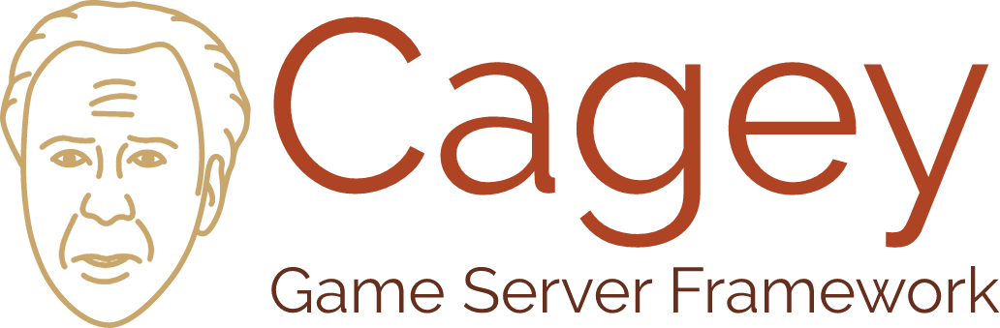

# Cagey core

[](https://greenkeeper.io/)

**WORK IN PROGRESS**



> [key-jee]
> 1. abbreviation: (CAGEY) Create A Game Engine Yourself
> 2. adjective: cautious, wary, or shrewd
> 3. adjective: Nicolas Cage-like

Logo created with https://logomakr.com

## What is Cagey?

Cagey is a code philosophy that makes the development of stateful game servers in Node.js easy, testable, flexible and
maintainable. It provides a foundation of rules for how things are supposed to connect, and an ecosystem of plugins that
follow this. The whole point of Cagey is to make integration with other technologies obvious and simple, while keeping a
very strict separation of concerns. For more information on these rules that plugins need to follow, please read
[#plugin-development](Plugin development).

Software development (which very much includes framework development) is not a solved problem. And as we move on and try
new concepts, we have to make some very strict decisions. That does not mean we believe these truths to be objective
truths, nor that we won't ever change our minds on these.

There are several layers at which you can observe your server technology. At its very heart, we want as much of our code
as possible to reflect *business logic*, not framework patterns, or the database we chose, or the network technology,
etc. If we ever want to switch frameworks, databases, KPI services, etc. this should be as painless as possible. The
fundamental nature of our business logic should not be contaminated by these choices.

Cagey attempts to solve this by keeping concerns separated as follows:

- Cagey Core
  - As small as possible
- Cagey Plugins
  - Concept *aware*
  - Technology *unaware*
  - Enable easy integration and switching of technologies in or out of a project
- Technology integrations
  - Made easy by Cagey plugins
  - 100% user land code (code can be inspired from documentation and examples that plugins provide)
  - As easy to change as any other user land code

## Getting started

This installs Cagey core and the most commonly used plugins:

```sh
npm install cagey cagey-sessions cagey-peer-network cagey-client-messenger
```

## Examples

See the [./examples](./examples) folder and the various plugins for examples.

## API

### Cagey core and Cagey plugins

Many Cagey API emit events. All events may be listened to with `async (...) => {}` functions. The execution will only
progress once all their promises have been resolved, and no errors were thrown.

### Cagey core

A cagey object provides process lifecycle management features.

**factory**

```js
const cagey = require('cagey').create({ log });
```

Creates and returns an instance of the `Cagey` class. You must pass a `cagey-logger` instance in an object.

**async cagey.shutdown()**

This emits:

- `"beforeShutdown" ()` on the cagey instance.
- `"shutdown" ()` on the cagey instance.

The events being emitted can be used to stop certain subsystems, and close connections.

Please note that this method does *not* kill the process. Cagey expects you to clean up or unref all I/O handlers, so
that Node.js will gracefully shut down when all work is done. If you really insist on killing the process, you can do
this manually:

```js
cagey.on('shutdown', () => { process.exit(0); });
```

## Plugins

- Logger: [cagey-logger](https://www.npmjs.com/package/cagey-logger)
- Client/server messaging: [cagey-client-messenger](https://www.npmjs.com/package/cagey-client-messenger)
- Cagey distributed cluster messaging: [cagey-peer-network](https://www.npmjs.com/package/cagey-peer-network)
- User sessions: [cagey-sessions](https://www.npmjs.com/package/cagey-sessions)

## Plugin development

When developing plugins for Cagey, please keep the following rules in mind.

- Plugins are supposed to be technology *concepts*, not implementations. Integration examples should be documented
  alongside your plugin (in an `examples/` folder, in your ReadMe file or in documentation elsewhere).
- A plugin solves only a single problem and should not exclude other plugins from being used on the same project.
  Having said that, documented integration patterns of the plugin may absolutely depend on other existing plugins.
- Prefix your NPM package name with `cagey-`.
- Wherever relevant, try to use the same dependencies for core functionality. This creates a consistent user experience,
  and reduces dependency chaos. For example:
  - Logging: [cagey-logger](https://www.npmjs.com/package/cagey-logger)
    - *always* accept an external cagey-logger object in setup.
    - *always* prefix log entries with `[subsystem-name] `.
    - usually stick to the `debug` level; leave higher levels to user land.
    - do not log errors that you do not catch and handle; leave that to user land.
  - EventEmitter: [eventemitter2](https://www.npmjs.com/package/eventemitter2)
    - *always* emit using `emitAsync` so listeners can safely do I/O if they need to.
  - Deep copy: [deep-copy](https://www.npmjs.com/package/deep-copy)
  - Configure duration using string notation, parseable with [parse-duration](https://www.npmjs.com/package/parse-duration)
  - Configure bytes using string notation, parseable with [bytes](https://www.npmjs.com/package/bytes)
- A well written plugin has:
  - Documentation
  - Usage examples
  - Unit tests
  - Static code analysis
  - A license that is identical to or compatible with Cagey
  - TravisCI and Greenkeeper

### Typical API

Your plugin should expose itself through a `create(apis, options)` method on the module:

```js
exports.create = function (apis, options) {
	return new MyPlugin(apis, options);
};
```

The constructor of your plugin can destructure the `apis` argument:

```js
const EventEmitter = require('eventemitter2').EventEmitter2;

class MyPlugin extends EventEmitter {
    constructor({ log }, options) {
        super();

        this.log = log;
    }
}
```

After that, it's up to you to shape your API.


## License

MIT

## Credit

Cagey is developed and maintained by [Wizcorp](https://wizcorp.jp/).
